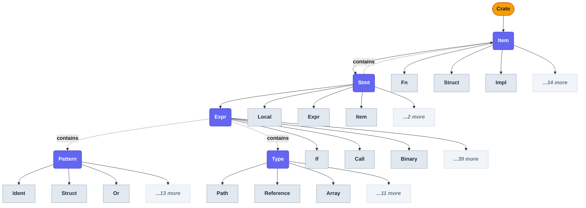

# Rust AST Schema

This repository defines a **schema-driven representation of the Rust Abstract Syntax Tree (AST)** used to generate macro-facing Rust syntax types.

The goal of this schema is to act as a **single source of truth** for generating Rust AST types and supporting APIs used by syntax tooling, procedural macro frameworks, or code transformation libraries.

This schema is **not a runtime AST** and is **not intended to implement a parser directly**. Instead, it defines the **public structural model** of Rust syntax that a generator can use to emit Rust code.

---

# Summary

| Concept | Meaning |
|---------|---------|
| [`product`](#product) | Rust struct — all fields exist simultaneously |
| [`sum`](#sum) | Rust enum with variants; variants may be fieldless (string shorthand) or carry fields |
| [`leaf`](#leaf) | Scalar primitive — wraps a single typed value directly |
| [`opaque`](#opaque) | Type-erased token stream, not decomposed |
| [`node_base`](#conventions) | Convention: inherits `span: Span` |
| [`attributed_node_base`](#conventions) | Convention: inherits `span` + `attrs: Vec<Attribute>` |
| [`types`](#types) | Primitive and container types used in fields |
| [`Box<T>`](#types) | Heap-allocated value (breaks recursive cycles) |
| [`Option<T>`](#types) | Optional field |
| [`Vec<T>`](#types) | Zero-or-more values |
| [`Punctuated<T, Sep>`](#types) | Separator-delimited list (e.g. `a, b, c`) |
| [`Delimited<T, Delim>`](#types) | Delimiter-wrapped value (e.g. `(expr)`) |
| [`Spanned<T>`](#types) | Value paired with its source span |
| [`nodes`](#nodes) | AST node definitions |

---

# Hierarchy

Each major sum type is shown with its variants as children. Product structs are leaves — they have fields but are not expanded here.



**Legend:** 🟡 `Crate` (root) &nbsp; 🟣 sum type &nbsp; ◻ variant (leaf) &nbsp; `···` more variants not shown

> Dashed arrows show cross-references between sum types — `Stmt` can contain `Item`, `Expr` can contain `Pattern` and `Type`. `Expr`, `Pattern`, and `Type` are also self-recursive.

# Design Goals

The schema is designed to support:

* generation of Rust `struct` and `enum` AST types
* generation of traversal traits (`Visit`, `VisitMut`, `Fold`)
* macro-friendly syntax nodes
* stable and ergonomic public APIs
* minimal boilerplate in the codebase
* long-term maintainability of the AST definition

The schema is intended to drive a generator that emits Rust code.

Example generator pipeline:

```
schema.yml
     ↓
Rust model (serde)
     ↓
code generator
     ↓
Rust AST types + helpers
```

---

# File Structure

```
schema.yml
├─ name / version / description
├─ conventions
├─ types
└─ nodes
```

---

# `schema`

Describes metadata about the schema itself.

Example:

```yaml
name: rust_ast
version: 0.1.0
description: Generator-oriented Rust AST schema
```

This allows generators to detect version changes and compatibility.

---

# `conventions`

Defines shared structural conventions used by AST nodes.

Example:

```yaml
conventions:
  node_base:
    fields:
      - name: span
        type: Span
```

Nodes that `extend` a convention inherit its fields automatically.

Two conventions are defined:

| Convention | Inherited fields | Use when |
|------------|-----------------|----------|
| `node_base` | `span: Span` | The node needs source location but no attributes |
| `attributed_node_base` | `span: Span`, `attrs: Vec<Attribute>` | The node can carry Rust attributes (`#[...]`) |

`attributed_node_base` itself extends `node_base`, so it always includes `span`.

Example — node without attributes:

```yaml
Path:
  kind: product
  extends: node_base
  # Inherits: span
  fields:
    - name: leading_colon
      type: bool
    - name: segments
      type: Punctuated<PathSegment, DoubleColon>
```

Example — node with attributes:

```yaml
TypeAlias:
  kind: product
  extends: attributed_node_base
  # Inherits: span, attrs
  fields:
    - name: name
      type: Ident
    - name: ty
      type: Type
```

---

# `types`

Defines primitive or wrapper types used by AST fields.

Example:

```yaml
types:
  primitives:
    - Span
    - bool
    - u8
    - u16
    - u32
    - u64
    - usize

  wrappers:
    - Box<T>
    - Option<T>
    - Vec<T>
    - Punctuated<T, Sep>
    - Delimited<T, Delim>
    - Spanned<T>

  separators:
    - '::'
    - ','
    - '+'
    - '|'
    - '&'

  delimiters:
    - Paren
    - Bracket
    - Brace
```

These are **not nodes**, but building blocks for fields.

| Wrapper | Meaning |
|---------|---------|
| `Box<T>` | Heap-allocated single value (used for recursive types) |
| `Option<T>` | Optional field |
| `Vec<T>` | Zero-or-more values |
| `Punctuated<T, Sep>` | A list of `T` separated by a punctuation token (e.g. `Punctuated<Type, ','>`) |
| `Delimited<T, Delim>` | A value wrapped in delimiters (e.g. `Delimited<Expr, Paren>` → `(expr)`) |
| `Spanned<T>` | A value paired with its source span |

Generators should treat these as container types.

---

# `nodes`

The `nodes` section defines every AST node.

Each node contains:

```
kind
doc          (optional)
extends      (optional)
fields or variants
```

Example:

```yaml
TypeAlias:
  kind: product
  doc: "A type alias definition (`type Foo = Bar`)."
  extends: attributed_node_base
  fields:
    - name: vis
      type: Visibility
    - name: name
      type: Ident
    - name: generic_params
      type: Option<GenericParams>
    - name: ty
      type: Type
```

This would generate something like:

```rust
/// A type alias definition (`type Foo = Bar`).
pub struct TypeAlias {
    pub span: Span,
    pub attrs: Vec<Attribute>,
    pub vis: Visibility,
    pub name: Ident,
    pub generic_params: Option<GenericParams>,
    pub ty: Type,
}
```

### `doc:`

The optional `doc:` field provides documentation for a node, variant, or field. Generators emit this as a Rust `///` doc comment on the generated type, variant, or field.

`doc:` can appear at three levels:

**Node level:**
```yaml
Expr:
  kind: sum
  doc: "A Rust expression — the primary recursive node covering all expression forms."
  variants: ...
```

**Variant level** (for `sum` nodes — object form only; string shorthand cannot carry `doc:`):
```yaml
Visibility:
  kind: sum
  variants:
    - name: Public
      doc: "Visible everywhere (`pub`)."
    - name: Restricted
      doc: "Visible within a specific path (`pub(in path)`)."
      fields:
        - name: path
          type: Box<Path>
```

**Field level:**
```yaml
Function:
  kind: product
  fields:
    - name: body
      type: TokenStream
      doc: "The function body as a raw token stream."
```

> **Note:** `doc:` in the schema describes the *generated Rust type* — it becomes `///` comments on emitted code. It is entirely separate from `DocString`, which is an AST node representing a documentation comment that appears *in the user's source code*.

---

# Node Kinds

Nodes are categorized using `kind`.

## `product`

Represents a **product type**.

Equivalent to a Rust `struct`.

All fields exist simultaneously.

Example:

```yaml
TypeAlias:
  kind: product
  extends: attributed_node_base
  fields:
    - name: vis
      type: Visibility
    - name: name
      type: Ident
    - name: ty
      type: Type
```

Generated Rust:

```rust
pub struct TypeAlias {
    pub span: Span,
    pub attrs: Vec<Attribute>,
    pub vis: Visibility,
    pub name: Ident,
    pub ty: Type,
}
```

The term **product** comes from algebraic data types:

```
TypeAlias = Visibility × Ident × Type
```

---

## `sum`

Represents a **sum type**.

Equivalent to a Rust `enum` with variants.

Variants can be written in two forms:

**Fieldless — string shorthand:**

```yaml
Asyncness:
  kind: sum
  variants:
    - Sync
    - Async
```

Generated Rust:

```rust
pub enum Asyncness {
    Sync,
    Async,
}
```

In algebraic terms:

```
Asyncness = Sync + Async
```

**Field-carrying — object form:**

```yaml
ConstValue:
  kind: sum
  variants:
    - name: Literal
      fields:
        - name: lit
          type: Lit
    - name: Block
      fields:
        - name: tokens
          type: TokenStream
```

Generated Rust:

```rust
pub enum ConstValue {
    Literal { lit: Lit },
    Block { tokens: TokenStream },
}
```

In algebraic terms:

```
ConstValue = Literal + Block
```

Both forms may be mixed in the same `variants` list.

> **Note:** String shorthand variants (`- Foo`) cannot carry `doc:`. Use object form (`name: Foo`) when a doc comment is needed on an individual variant.

---

## `opaque`

Represents a **type-erased token stream** whose internal structure is not modeled by the schema.

Use this for syntax forms that cannot be expressed as structured nodes — typically raw token sequences passed through verbatim.

Example:

```yaml
TokenStream:
  kind: opaque
```

Generated Rust (generator-defined):

```rust
pub struct TokenStream(proc_macro2::TokenStream);
```

Generators are responsible for deciding how to represent opaque nodes; the schema only signals that no field decomposition is expected.

---

## `leaf`

Represents a **scalar primitive** — a single typed value with no child nodes.

Used for identifiers, literals, and other atomic values that wrap a primitive type directly.

Example:

```yaml
Ident:
  kind: leaf
  type: Ident

LitStr:
  kind: leaf
  type: String

LitInt:
  kind: leaf
  type: String
```

Generated Rust (generator-defined representation):

```rust
pub struct Ident(proc_macro2::Ident);
pub struct LitStr(String);
pub struct LitInt(String);
```

Leaf nodes do not extend conventions and have no `fields:` — they are terminal values.

---

# Fields

Fields define the properties of a node.

Example:

```yaml
fields:
  - name: ident
    type: Ident
```

Supported patterns:

```
Type
Option<Type>
Vec<Type>
Box<Type>
Punctuated<T, ','>
```

These should be interpreted by the generator.

---

# Variants

Variants are used in `sum` nodes.

Variants can be written in two forms:

**String shorthand** — for fieldless variants:

```yaml
variants:
  - Foo
  - Bar
```

**Object form** — for variants with fields (or when a `doc:` is needed):

```yaml
variants:
  - name: Literal
    fields:
      - name: lit
        type: Lit
  - name: Block
    fields:
      - name: tokens
        type: TokenStream
```

Both forms may be mixed in the same `variants` list.

---

# Spans

Most nodes inherit a `span` field through `node_base`.

Example:

```
span: Span
```

This represents the source location of the syntax node.

Generators should ensure this field exists on nodes extending `node_base`.

---

# Macro-Facing Design

The schema is optimized for **procedural macro tooling**, not compilers.

This means:

* nodes are ergonomic to use
* token fidelity may be relaxed
* certain constructs use verbatim token streams
* identifiers and literals are first-class types

Examples:

```
Ident
Lifetime
LitStr
LitInt
```

---

# Verbatim Syntax

Some syntax forms cannot be represented as structured nodes — for example, deeply nested or non-standard macro bodies.

For those cases the schema defines `TokenStream` as an `opaque` node. Generators pass its content through as a raw token stream without decomposing it.

```yaml
TokenStream:
  kind: opaque
```

Fields that accept unstructured syntax use `TokenStream` directly:

```yaml
Function:
  kind: product
  fields:
    - name: body
      type: TokenStream   # function body — not further decomposed
```

The `preserve_verbatim_tokens: true` generator hint ensures these values are forwarded unchanged.

---

# Extending the Schema

To add a new node:

1. Choose the correct `kind`
2. Define fields or variants
3. Optionally extend a convention
4. Add it to a section

Example:

```yaml
ExprFoo:
  kind: product
  extends: node_base
  fields:
    - name: value
      type: Expr
```

---

# Intended Output

A generator consuming this schema should produce:

* Rust AST structs and enums
* traversal traits (`Visit`, `VisitMut`, `Fold`)
* module organization
* optionally builders or helpers

The schema is designed to allow **large AST systems to be generated automatically** rather than handwritten.

---

This schema acts as the **canonical definition of the Rust AST model** used by the generator and should be treated as the **single source of truth** for syntax structure.
